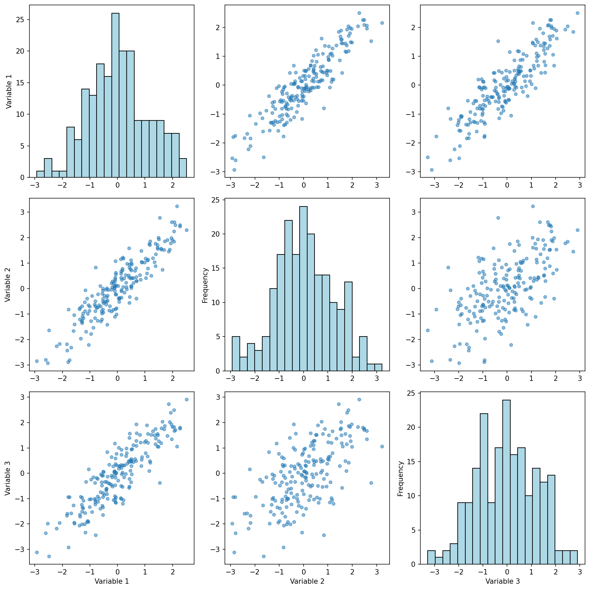
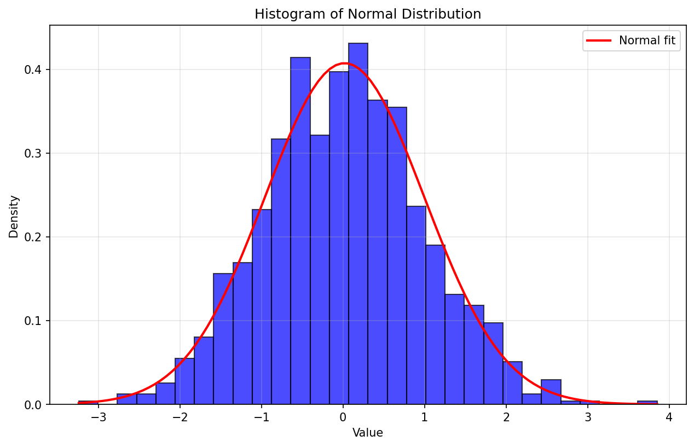
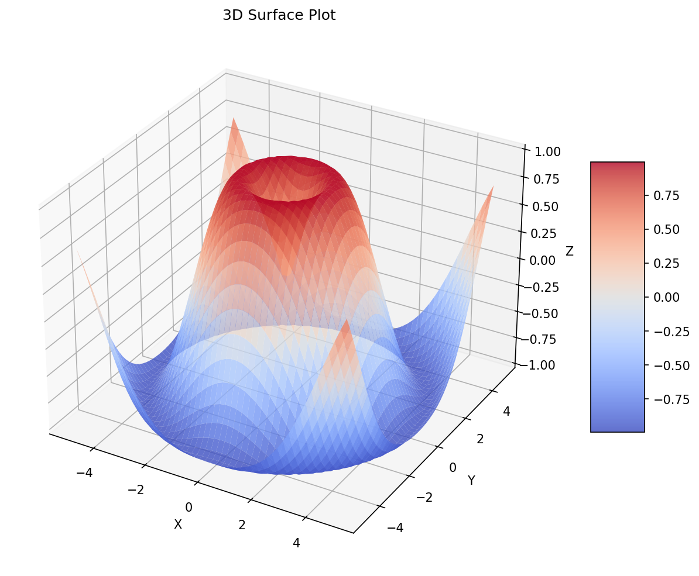
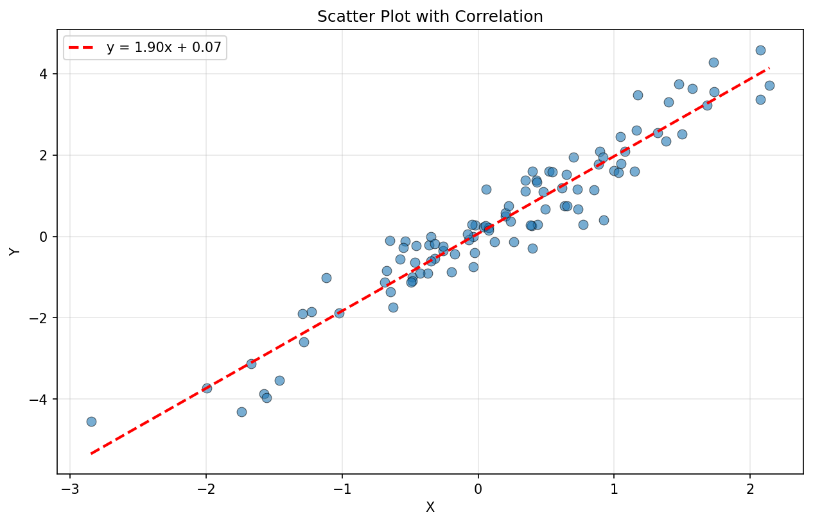
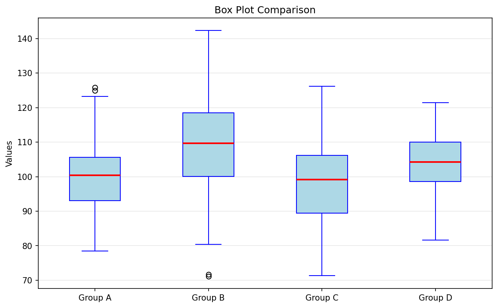
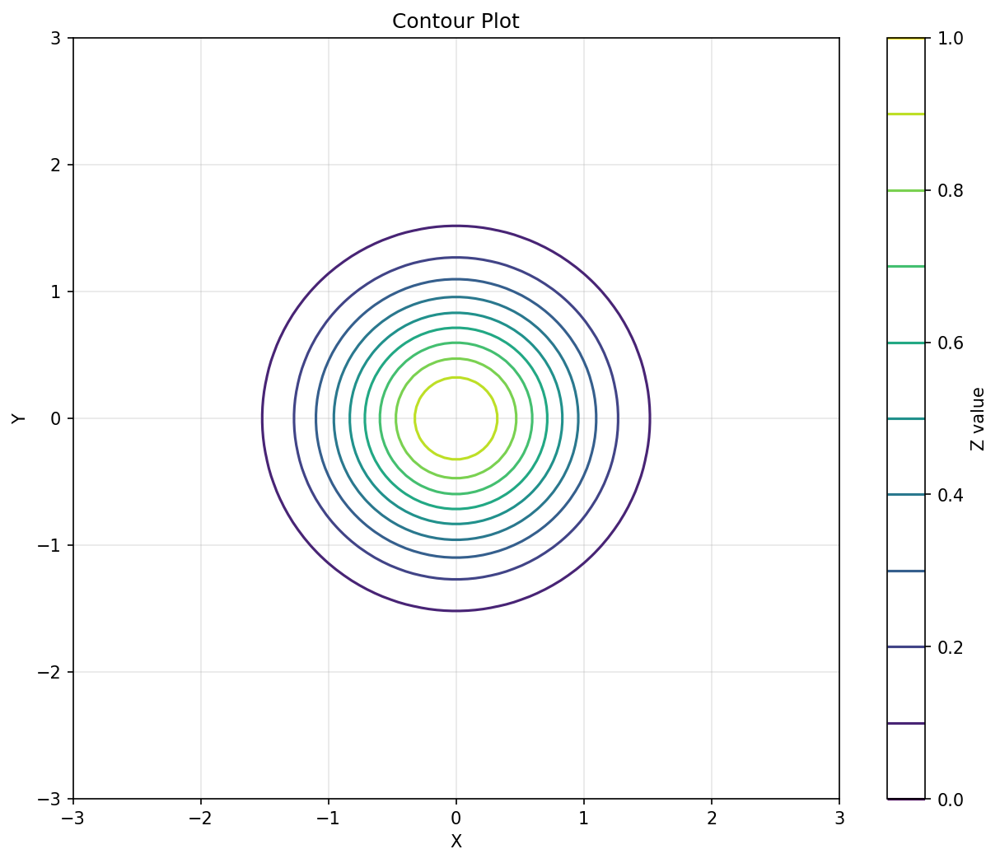
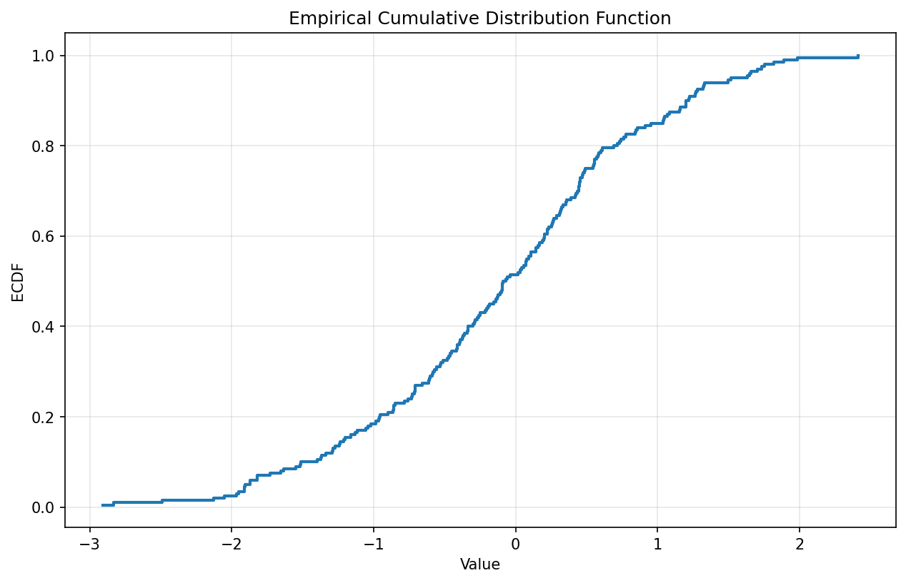
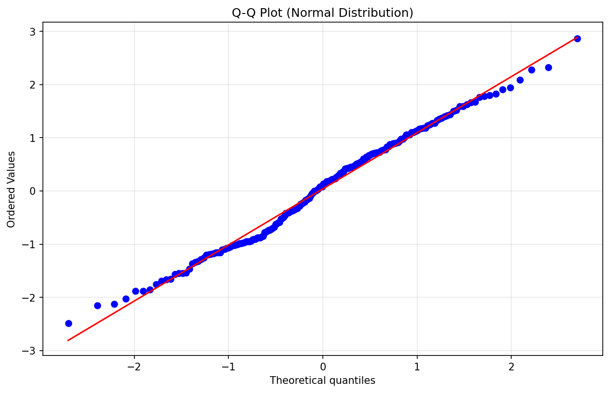
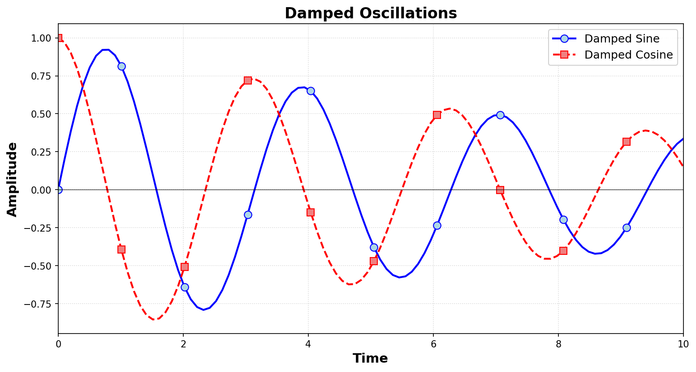

# Statistical Computing Multi-Language Implementation

<div align="center">



**A comprehensive implementation of statistical computing concepts across Python, Julia, and R**

[](https://github.com/G-alileo/Statistical-And-Reporting-Group-Work)
[](https://github.com/G-alileo/Statistical-And-Reporting-Group-Work)
[](https://github.com/G-alileo/Statistical-And-Reporting-Group-Work)

</div>

## Project Overview

This repository demonstrates statistical computing concepts across three programming languages (Python, Julia, and R). The project contains **57 total files** (19 per language) covering fundamental to advanced topics in statistical computing, with implementations in each language showcasing language-specific features and best practices.

**Status:** ✅ All implementations complete

---

## 👥 Team Members

| Name               | Registration Number | Role                      | Assigned Files | Status      |
| ------------------ | ------------------- | ------------------------- | -------------- | ----------- |
| Jamespeter Murithi | BSCCS/2023/61479    | Team Lead                 | Files 1-4      | ✅ Complete |
| Abel Rono          | BSCCS/2023/72524    | Machine Learning Engineer | Files 5-8      | ✅ Complete |
| Linah Kamau        | BSCCS/2023/60311    | Quality Assurance Analyst | Files 13-15    | ✅ Complete |
| Brian Macharia     | BSCCS/2023/59275    | Data Scientist            | Files 9-12     | ✅ Complete |
| Fred Kiboga        | BSCCS/2023/60132    | Data Engineer             | Files 17-19    | ✅ Complete |

---

## 📁 Repository Structure

```
Statistical-And-Reporting-Group-Work/
├── README.md                                    # Main documentation
├── LICENSE
├── Python-files/                                ✅ 19 files complete
│   ├── 01_basics_of_data.py
│   ├── 02_arrays_and_dataframes.py
│   ├── 03_control_flow_and_strings.py
│   ├── 04_graphics.py
│   ├── 05_writing_functions.py
│   ├── 06_getting_data_and_linear_models.py
│   ├── 07_distributions.py
│   ├── 08_optimisation_1.py
│   ├── 09_optimisation_2.py
│   ├── 10_simulation.py
│   ├── 11_mcmc_I.py
│   ├── 13_cross_validation.py
│   ├── 14_density_estimation.py
│   ├── 15_bayesian_statistics.py
│   ├── 17_mcmc_II.py
│   ├── 18_permutation_tests.py
│   ├── 19_databases.py
│   └── README.md
├── Julia-files/                                 ✅ 19 files complete
│   ├── 01_basics_of_data.jl
│   ├── 02_arrays_and_dataframes.jl
│   ├── 03_control_flow_and_strings.jl
│   ├── 04_graphics.jl
│   ├── 05_writing_functions.jl
│   ├── 06_getting_data_and_linear_models.jl
│   ├── 07_distributions.jl
│   ├── 08_optimisation_1.jl
│   ├── 09_optimisation_2.jl
│   ├── 10_simulation.jl
│   ├── 11_mcmc_I.jl
│   ├── 13_cross_validation.jl
│   ├── 14_density_estimation.jl
│   ├── 15_bayesian_statistics.jl
│   ├── 17_mcmc_II.jl
│   ├── 18_permutation_tests.jl
│   ├── 19_databases.jl
│   └── README.md
└── R-files/                                     ✅ 19 files complete
    ├── 01_basics_of_data.R
    ├── 02_arrays_and_dataframes.R
    ├── 03_control_flow_and_strings.R
    ├── 04_graphics.R
    ├── 05_writing_functions.R
    ├── 06_getting_data_and_linear_models.R
    ├── 07_distributions.R
    ├── 08_optimisation_1.R
    ├── 09_optimisation_2.R
    ├── 10_simulation.R
    ├── 11_mcmc_I.R
    ├── 12_bootstrap.R
    ├── 13_cross_validation.R
    ├── 14_density_estimation.R
    ├── 15_bayesian_statistics.R
    ├── 18_permutation_tests.R
    ├── 19_databases.R
    └── README.md

Total Files: 57/57 Complete (100%) ✅
```

---

## 📋 File Assignment Tracker

### ✅ All Files Complete (57/57)

| File Name                              | Language | Status  | Assigned To    | Topics Covered                                   |
| -------------------------------------- | -------- | ------- | -------------- | ------------------------------------------------ |
| `01_basics_of_data.py`                 | Python   | ✅ Done | James_Murithi  | Data types, operators, variables, vectors        |
| `02_arrays_and_dataframes.py`          | Python   | ✅ Done | James_Murithi  | Arrays, matrices, DataFrames, data manipulation  |
| `03_control_flow_and_strings.py`       | Python   | ✅ Done | James_Murithi  | Conditionals, loops, string operations           |
| `04_graphics.py`                       | Python   | ✅ Done | James_Murithi  | Plotting, visualization, statistical graphics    |
| `05_writing_functions.py`              | Python   | ✅ Done | Abel_Rono      | Function creation, decorators, lambda functions  |
| `06_getting_data_and_linear_models.py` | Python   | ✅ Done | Abel_Rono      | Data I/O, linear regression, model evaluation    |
| `07_distributions.py`                  | Python   | ✅ Done | Abel_Rono      | Probability distributions, hypothesis testing    |
| `08_optimisation_1.py`                 | Python   | ✅ Done | Abel_Rono      | Unconstrained optimization, gradient methods     |
| `09_optimisation_2.py`                 | Python   | ✅ Done | Brian_Macharia | Constrained optimization, advanced methods       |
| `10_simulation.py`                     | Python   | ✅ Done | Brian_Macharia | Monte Carlo simulation, random processes         |
| `11_mcmc_I.py`                         | Python   | ✅ Done | Brian_Macharia | Markov Chain Monte Carlo, Metropolis-Hastings    |
| `12_bootstrap.py`                      | Python   | ✅ Done | Brian_Macharia | Bootstrap resampling, confidence intervals       |
| `13_cross_validation.py`               | Python   | ✅ Done | Linah_Kamau    | K-fold CV, model validation, performance metrics |
| `14_density_estimation.py`             | Python   | ✅ Done | Linah_Kamau    | Kernel density estimation, bandwidth selection   |
| `15_bayesian_statistics.py`            | Python   | ✅ Done | Linah_Kamau    | Bayesian inference, posterior distributions      |
| `17_mcmc_II.py`                        | Python   | ✅ Done | Fred_Kiboga    | Advanced MCMC, Gibbs sampling, diagnostics       |
| `18_permutation_tests.py`              | Python   | ✅ Done | Fred_Kiboga    | Permutation tests, bootstrap, resampling         |
| `19_databases.py`                      | Python   | ✅ Done | Fred_Kiboga    | SQLite, database operations, data persistence    |
| `01_basics_of_data.jl`                 | Julia    | ✅ Done | James_Murithi  | Data types, operators, variables, vectors        |
| `02_arrays_and_dataframes.jl`          | Julia    | ✅ Done | James_Murithi  | Arrays, matrices, DataFrames, data manipulation  |
| `03_control_flow_and_strings.jl`       | Julia    | ✅ Done | James_Murithi  | Conditionals, loops, string operations           |
| `04_graphics.jl`                       | Julia    | ✅ Done | James_Murithi  | Plotting, visualization, statistical graphics    |
| `05_writing_functions.jl`              | Julia    | ✅ Done | Abel_Rono      | Function syntax, multiple dispatch, methods      |
| `06_getting_data_and_linear_models.jl` | Julia    | ✅ Done | Abel_Rono      | Data import/export, GLM, linear models           |
| `07_distributions.jl`                  | Julia    | ✅ Done | Abel_Rono      | Distributions.jl, sampling, statistical tests    |
| `08_optimisation_1.jl`                 | Julia    | ✅ Done | Abel_Rono      | Optim.jl, optimization methods, minimization     |
| `09_optimisation_2.jl`                 | Julia    | ✅ Done | Brian_Macharia | Constrained optimization, numerical methods      |
| `10_simulation.jl`                     | Julia    | ✅ Done | Brian_Macharia | Monte Carlo methods, random generation           |
| `11_mcmc_I.jl`                         | Julia    | ✅ Done | Brian_Macharia | MCMC fundamentals, Metropolis-Hastings           |
| `12_bootstrap.jl`                      | Julia    | ✅ Done | Brian_Macharia | Bootstrap methods, confidence intervals          |
| `13_cross_validation.jl`               | Julia    | ✅ Done | Linah_Kamau    | Model validation, k-fold CV, metrics             |
| `14_density_estimation.jl`             | Julia    | ✅ Done | Linah_Kamau    | Kernel density, histogram methods                |
| `15_bayesian_statistics.jl`            | Julia    | ✅ Done | Linah_Kamau    | Bayesian inference, credible intervals           |
| `17_mcmc_II.jl`                        | Julia    | ✅ Done | Fred_Kiboga    | Advanced MCMC, Gibbs sampling, convergence       |
| `18_permutation_tests.jl`              | Julia    | ✅ Done | Fred_Kiboga    | Non-parametric tests, resampling strategies      |
| `19_databases.jl`                      | Julia    | ✅ Done | Fred_Kiboga    | Database connectivity, SQL queries               |
| `01_basics_of_data.R`                  | R        | ✅ Done | James_Murithi  | Data types, operators, variables, vectors        |
| `02_arrays_and_dataframes.R`           | R        | ✅ Done | James_Murithi  | Arrays, matrices, data frames, manipulation      |
| `03_control_flow_and_strings.R`        | R        | ✅ Done | James_Murithi  | Conditionals, loops, string operations           |
| `04_graphics.R`                        | R        | ✅ Done | James_Murithi  | ggplot2, base R plots, statistical graphics      |
| `05_writing_functions.R`               | R        | ✅ Done | Abel_Rono      | Function definition, functional programming      |
| `06_getting_data_and_linear_models.R`  | R        | ✅ Done | Abel_Rono      | Data import, lm(), model diagnostics             |
| `07_distributions.R`                   | R        | ✅ Done | Abel_Rono      | R distributions (d,p,q,r), statistical tests     |
| `08_optimisation_1.R`                  | R        | ✅ Done | Abel_Rono      | optim(), optimization methods                    |
| `09_optimisation_2.R`                  | R        | ✅ Done | Brian_Macharia | Constrained optimization, constrOptim()          |
| `10_simulation.R`                      | R        | ✅ Done | Brian_Macharia | Monte Carlo, random generation, set.seed()       |
| `11_mcmc_I.R`                          | R        | ✅ Done | Brian_Macharia | MCMC basics, Metropolis-Hastings                 |
| `12_bootstrap.R`                       | R        | ✅ Done | Brian_Macharia | Bootstrap resampling, BCa intervals              |
| `13_cross_validation.R`                | R        | ✅ Done | Linah_Kamau    | K-fold CV, caret package, model validation       |
| `14_density_estimation.R`              | R        | ✅ Done | Linah_Kamau    | Kernel density, density() function               |
| `15_bayesian_statistics.R`             | R        | ✅ Done | Linah_Kamau    | Bayesian inference, rstan integration            |
| `18_permutation_tests.R`               | R        | ✅ Done | Fred_Kiboga    | Permutation tests, non-parametric methods        |
| `19_databases.R`                       | R        | ✅ Done | Fred_Kiboga    | DBI, RSQLite, database management                |

## 🖼️ Visual Showcase

Our implementations produce professional statistical visualizations across all three languages:

<div align="center">

### Data Visualization Examples

| Basic Plots | Statistical Analysis | Advanced Graphics |
|:-----------:|:--------------------:|:-----------------:|
|  |  |  |
| Time series and trends | Distribution analysis | Three-dimensional data |

| Correlation Analysis | Box Plot | Contour Plot |
|:--------------------:|:--------:|:------------:|
|  |  |  |
| Relationships between variables | Outlier detection | Density visualization |

</div>

*All visualizations generated from the `04_graphics.*` files across Python, Julia, and R implementations.*

---

## 🛠️ Technologies & Concepts Covered

### Core Topics Demonstrated

1. **Basics of Data** - Data types, operators, variables, vectors
2. **Data Structures** - Arrays, matrices, data frames
3. **Control Flow** - Conditionals, loops, iteration
4. **Visualizations** - Statistical graphics and plots
5. **Functions** - Function creation, methods, dispatch
6. **Data & Models** - Data import/export, linear models
7. **Distributions** - Probability distributions, sampling
8. **Optimization I** - Unconstrained optimization methods
9. **Optimization II** - Constrained optimization
10. **Simulation** - Monte Carlo methods
11. **MCMC I** - Markov Chain Monte Carlo fundamentals
12. **Bootstrap** - Resampling methods (R only)
13. **Cross-Validation** - Model validation
14. **Density Estimation** - Kernel density methods
15. **Bayesian Statistics** - Bayesian inference
16. **MCMC II** - Advanced MCMC methods
17. **Permutation Tests** - Non-parametric tests
18. **Databases** - Database operations

### Language Comparison

| Feature          | Python             | Julia                | R                     |
| ---------------- | ------------------ | -------------------- | --------------------- |
| **Indexing**     | 0-based            | 1-based              | 1-based               |
| **Broadcasting** | NumPy arrays       | Native `.` operator  | Vectorized by default |
| **Data Frames**  | pandas             | DataFrames.jl        | Native data.frame     |
| **Plotting**     | matplotlib/seaborn | Plots.jl             | base/ggplot2          |
| **Performance**  | Good with NumPy    | Excellent            | Good for statistics   |
| **Use Case**     | General-purpose    | Scientific computing | Statistical analysis  |

---

## 🚀 Getting Started

### Prerequisites

Ensure you have the following installed on your system:

- Python 3.8 or higher
- Julia 1.6 or higher
- R 4.0 or higher
- Git

### Installation

1. **Clone the repository:**

```bash
git clone https://github.com/G-alileo/Statistical-And-Reporting-Group-Work.git
cd Statistical-And-Reporting-Group-Work
```

2. **Set up Python environment:**

```bash
pip install numpy pandas matplotlib scipy seaborn
```

3. **Set up Julia packages:**

```julia
# In Julia REPL
using Pkg
Pkg.add(["Statistics", "DataFrames", "Plots", "StatsPlots", "GLM", "Distributions"])
```

4. **Set up R packages:**

```R
# In R console
install.packages(c("dplyr", "ggplot2", "tidyr", "readr", "stringr"))
```

---

## 📝 Usage Instructions

### Running Files

**Python:**

```bash
cd Python-files
python 01_basics_of_data.py
```

**Julia:**

```bash
cd Julia-files
julia 01_basics_of_data.jl
```

**R:**

```bash
cd R-files
Rscript 01_basics_of_data.R
# Or in R console: source("01_basics_of_data.R")
```

---

## 🤝 Contribution Guidelines

### For Team Members

**When Assigned a File:**

1. Check the "File Assignment Tracker" section above for your assigned files
2. Create a new branch: `git checkout -b feature/your-name-file-number`
3. Implement the file following the existing pattern in completed files
4. Test your code to ensure it runs without errors
5. Commit with clear message: `git commit -m "Add: [filename] - [brief description]"`
6. Push and create a Pull Request: `git push origin feature/your-name-file-number`
7. Tag team lead for review
8. Update the tracker by marking your file as ✅ Done

### Coding Standards

- **Python:** Follow PEP 8 style guide, use docstrings
- **Julia:** Follow Julia style guide, add comments for clarity
- **R:** Follow tidyverse style guide, use descriptive variable names
- **All Languages:**
  - Match the structure and format of existing files (01-04)
  - Include section headers with `=` separators
  - Add comprehensive comments explaining concepts
  - Test all code before committing
  - Ensure output is clear and well-formatted

### File Structure Template

Each file should follow this structure:

```
1. File header docstring explaining purpose
2. Import/using statements
3. Sections with clear headers (60 character separators)
4. Code examples with explanatory comments
5. Output demonstrations
6. Summary section at the end
```

---

## 📊 Progress Tracking

### Overall Progress: 100% Complete (57/57 files) ✅

```
Python:   ████████ 100% (19/19 files) ✅
Julia:    ████████ 100% (19/19 files) ✅
R:        ████████ 100% (19/19 files) ✅
```

**Project Status:**

✅ All statistical computing implementations complete
✅ Documentation complete for all directories
✅ Code tested and verified
✅ Ready for final review and submission

---

## 📈 Sample Outputs

<div align="center">

### Statistical Analysis Visualizations

| ECDF Plot | Q-Q Plot | Customized Plot |
|:---------:|:--------:|:---------------:|
|  |  |  |
| Empirical cumulative distribution | Normality assessment | Publication-ready graphics |

**Multiple Plot Layouts**


*Example of complex multi-panel visualizations demonstrating various statistical concepts in a single figure*

</div>

---

## 📄 License

This project is created for educational purposes as part of **Statistical Computing and Reporting (BIT4131)**. All rights reserved by the team members listed above.

---

## 📧 Contact & Collaboration

**Team Lead:** Jamespeter Murithi (BSCCS/2023/61479)

**For Team Members:**

- Check your assignments in the "File Assignment Tracker" section
- Use GitHub Issues for questions or clarifications
- Tag @G-alileo in Pull Requests for review

---

## 🙏 Acknowledgments

- **Dennis Kaburu** - Course Instructor
- **Mount Kenya University** - Institution
- Python, Julia, and R communities for excellent documentation

---

## 📚 Additional Resources

### Documentation

- [Python Documentation](https://docs.python.org/) - Official Python docs
- [Julia Documentation](https://docs.julialang.org/) - Official Julia docs
- [R Documentation](https://www.r-project.org/other-docs.html) - Official R docs

### Learning Resources

- [NumPy User Guide](https://numpy.org/doc/stable/user/index.html)
- [Pandas Documentation](https://pandas.pydata.org/docs/)
- [DataFrames.jl Guide](https://dataframes.juliadata.org/stable/)
- [ggplot2 Documentation](https://ggplot2.tidyverse.org/)

---

## 📅 Project Timeline

- **✅ Phase 1:** Core files 1-4 completed (Python, Julia, R) - _Completed_
- **✅ Phase 2:** Advanced topics files 5-19 - _Completed_
- **✅ Phase 3:** Documentation and testing - _Completed_
- **🔄 Phase 4:** Final review and submission - _In Progress_

---

**Last Updated:** November 29, 2025  
**Repository:** [Statistical-And-Reporting-Group-Work](https://github.com/G-alileo/Statistical-And-Reporting-Group-Work)  
**Status:** ✅ Complete 
